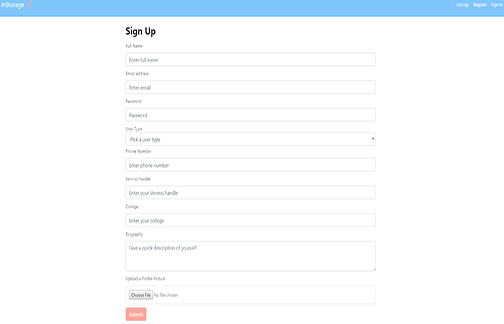
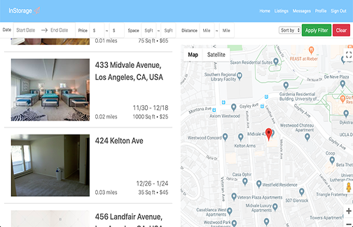
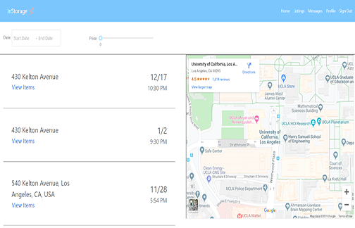
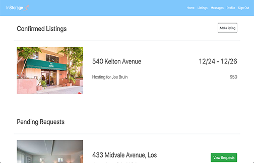
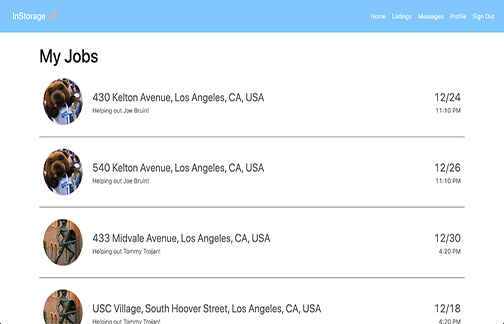
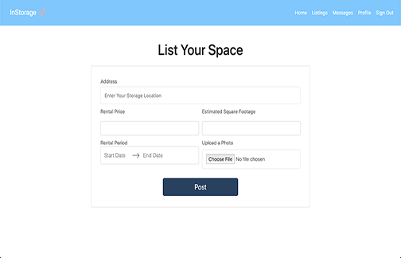
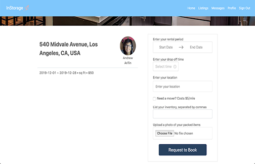
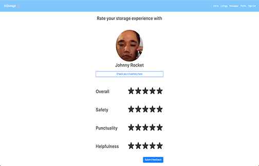

# InStorage

## Overview
This was a 5-person group project done for my Software Engineering course. We like to say that this is Airbnb for storage but combined with Uber for moving. We built a web application aimed at solving the storage issues for college students.

Our app provides three main services:
* Students to store their items at a more reasonable price
* Students to rent out the empty spaces in their apartments to make extra money.
* Students to make easy money helping move items between apartments.

## Technologies Used
* Firebase
* React.js
* Node.js and Express
* Jest and Enzyme

## My Contributions
In this project, I was primarily a front-end developer and designed many of the UI components and pages. I also performed input validation for all user input, and implemented authentication, authorization, and routing functionalities using Firebase Authentication and React Router.

Here are some of the pages I was responsible for.

#### Home Page

#### Signup Page

#### Browse Listings Page

#### Browse Moving Jobs Page

#### Host Home

#### Mover Home

#### Post Listings Page

#### Book Listings Page

#### User Ratings Page

